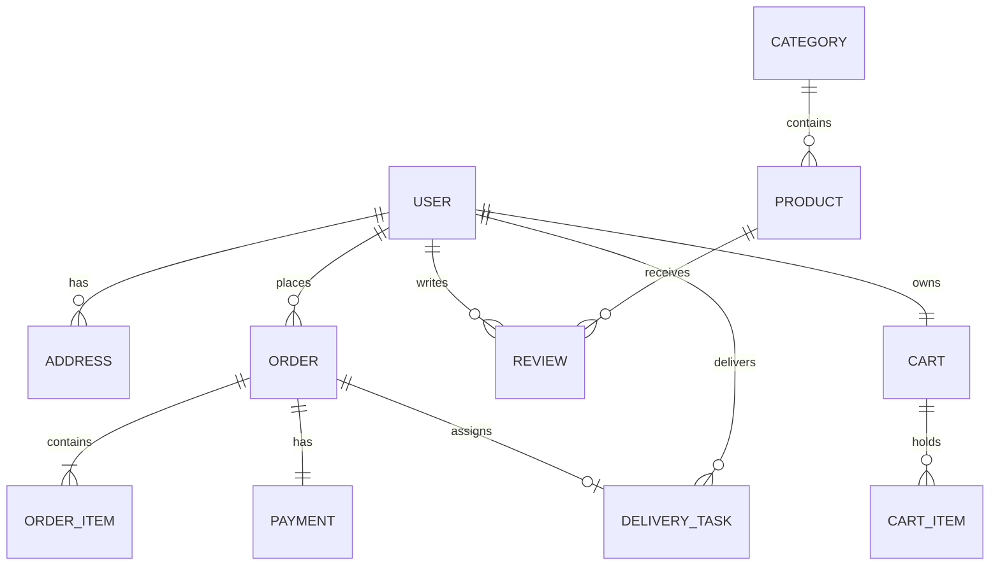

# 🛒 Grocery Delivery Platform — Production Blueprint & Architecture Specification

## 1. Executive Summary & System Overview

This blueprint defines the end-to-end architecture, technical standards, database schemas, security protocols, DevOps infrastructure, and operational readiness for taking the **Grocery Delivery Platform** to high-scale production.

```
                                  [ Global CDN / Cloudflare ]
                                               │
                         ┌─────────────────────┴─────────────────────┐
                         ▼                                           ▼
             [ Frontend Application ]                    [ Nginx Reverse Proxy / LB ]
             (React 18 + Vite + Tailwind)                            │
                         │                                           ▼
                         │ HTTPS / WSS                   [ Backend API Cluster ]
                         └──────────────────────────────► (Express.js / Node.js)
                                                         │   │   │   │
                                    ┌────────────────────┘   │   │   └────────────────────┐
                                    ▼                        ▼   ▼                        ▼
                          [ MongoDB Atlas ]             [ Redis Cache ]             [ 3rd Party APIs ]
                          (Primary Database)            - Session Store             - Stripe / Razorpay
                          - Replica Set                 - Cart State                - Twilio / SendGrid
                          - Sharded Collections         - Pub/Sub Live Tracking     - AWS S3 / Cloudinary
                                                        - Rate Limiting             - Google Maps API
```

---

## 2. System Architecture & Components

### 2.1 Technology Stack Matrix

| Layer | Component | Production Standard / Choice | Rationale |
| :--- | :--- | :--- | :--- |
| **Client (Frontend)** | Framework | React 18 + Vite | Blazing fast HMR, optimized production tree-shaking, lightweight bundles |
| | Styling & UI | TailwindCSS + Lucide Icons | Utility-first, zero runtime overhead, responsive design |
| | State Management | Zustand / React Context | Clean, minimal boilerplate, granular selector re-renders |
| | Real-Time | Socket.io Client | Bidirectional live order status & driver location tracking |
| | HTTP Client | Axios + Interceptors | Centralized auth token refresh, retry exponential backoff |
| **Server (Backend)** | Runtime | Node.js (v20 LTS) + Express | Asynchronous event-driven I/O, rich ecosystem |
| | Process Manager | PM2 Cluster Mode / Docker | Auto-restart, multi-core CPU utilization, zero-downtime reload |
| | Authentication | JWT (Access + HttpOnly Refresh Token) + Argon2/Bcrypt | OWASP compliant token rotation & secure password hashing |
| | Validation | Zod / Joi | Strict schema enforcement on all incoming request payloads |
| | Real-Time Engine | Socket.io + Redis Adapter | Horizontal scaling of real-time WebSocket rooms |
| **Data Layer** | Primary DB | MongoDB Atlas (v7.x) | Flexible document model for product catalog, orders & addresses |
| | In-Memory / Cache | Redis (v7.x) | Hot-product caching, session stores, rate-limiting counters, Geo tracking |
| | File & Media Storage | Cloudinary / AWS S3 + CloudFront CDN | Optimized WebP product image transformations and fast delivery |
| **DevOps & Infrastructure** | Containers | Docker Multi-Stage Builds | Minimal container attack surface, reproducible artifacts |
| | Reverse Proxy | Nginx (Alpine) + Let's Encrypt SSL | SSL termination, Brotli/Gzip compression, DDoS defense |
| | CI/CD | GitHub Actions | Automated lint, unit/integration tests, image build & deploy |
| | Monitoring & Logs | Winston + Morgan + Sentry + Prometheus | Centralized structured JSON logging, exception tracking, metrics |

---

## 3. Database Schema & Data Models

### 3.1 Entity Relationship Overview



### 3.2 Core Model Specifications

#### 1. `User` Schema
- `_id`: `ObjectId`
- `name`: `String` (Indexed, required)
- `email`: `String` (Unique, indexed, required)
- `phone`: `String` (Unique, indexed, required)
- `password`: `String` (Hashed, select: false)
- `role`: `Enum['customer', 'driver', 'admin', 'store_manager']` (default: 'customer')
- `avatar`: `String` (URL)
- `isPhoneVerified`: `Boolean` (default: false)
- `isEmailVerified`: `Boolean` (default: false)
- `driverProfile`: `Object` (Vehicle details, license number, isAvailable, currentLocation: GeoJSON)
- `createdAt`, `updatedAt`: `Timestamps`

#### 2. `Product` Schema
- `_id`: `ObjectId`
- `title`: `String` (Text indexed, required)
- `slug`: `String` (Unique, indexed)
- `description`: `String`
- `category`: `ObjectId` (Ref: 'Category', indexed)
- `brand`: `String`
- `sku`: `String` (Unique, indexed)
- `price`: `Number` (required)
- `discountPrice`: `Number` (optional)
- `unit`: `String` (e.g., '1 kg', '500 g', '1 pc', '1 L')
- `stock`: `Number` (required, indexed, min: 0)
- `isAvailable`: `Boolean` (default: true)
- `images`: `Array<{ url: String, publicId: String, isPrimary: Boolean }>`
- `nutritionalInfo`: `Map / Object`
- `ratings`: `{ average: Number, count: Number }`
- `tags`: `[String]` (e.g., ['organic', 'dairy', 'express-delivery'])
- `createdAt`, `updatedAt`: `Timestamps`

#### 3. `Order` Schema
- `_id`: `ObjectId`
- `orderNumber`: `String` (Unique human-readable: `ORD-YYYYMMDD-XXXXX`)
- `customer`: `ObjectId` (Ref: 'User', indexed)
- `items`: `Array<{ product: ObjectId, title: String, price: Number, quantity: Number, unit: String, subtotal: Number }>`
- `deliveryAddress`: `Object` (Street, Landmark, City, State, Pincode, Coordinates: [lng, lat])
- `billSummary`: `{ itemsTotal: Number, deliveryFee: Number, tax: Number, discount: Number, grandTotal: Number }`
- `paymentStatus`: `Enum['pending', 'paid', 'failed', 'refunded']`
- `paymentMethod`: `Enum['card', 'upi', 'cod', 'wallet']`
- `paymentId`: `String` (Gateway transaction ID)
- `orderStatus`: `Enum['placed', 'confirmed', 'packed', 'out_for_delivery', 'delivered', 'cancelled']` (indexed)
- `driver`: `ObjectId` (Ref: 'User', nullable)
- `estimatedDeliveryTime`: `Date`
- `deliveredAt`: `Date`
- `cancellationReason`: `String`
- `timeline`: `Array<{ status: String, timestamp: Date, note: String }>`

---

## 4. API Endpoints Specification (REST & WebSocket)

### 4.1 Authentication & Profile (`/api/auth`, `/api/users`)
- `POST /api/auth/register` — Create customer/driver account
- `POST /api/auth/login` — Authenticate and receive JWT access + refresh tokens
- `POST /api/auth/refresh-token` — Silent refresh rotation
- `POST /api/auth/otp/send` & `POST /api/auth/otp/verify` — Phone login / 2FA
- `GET /api/users/profile` & `PUT /api/users/profile` — View & update profile
- `GET /api/users/addresses` & `POST /api/users/addresses` — Manage multi-address book

### 4.2 Product & Catalog (`/api/products`, `/api/categories`)
- `GET /api/categories` — Nested hierarchy & featured categories
- `GET /api/products` — Filterable catalog (by category, price range, search query, stock status, sorting)
- `GET /api/products/:slugOrId` — Product details with real-time stock availability
- `POST /api/products` *(Admin)* — Create product + upload asset
- `PATCH /api/products/:id/stock` *(Admin/Manager)* — Bulk / quick inventory adjustments

### 4.3 Cart & Checkout (`/api/cart`, `/api/orders`, `/api/payments`)
- `GET /api/cart` & `POST /api/cart/sync` — Redis-backed fast cart synchronization
- `POST /api/orders` — Create order, atomic inventory decrement lock
- `GET /api/orders/my-orders` — Customer order history with pagination
- `GET /api/orders/:id` — Real-time order progress details
- `POST /api/payments/create-intent` — Initiate Stripe / Razorpay order session
- `POST /api/payments/webhook` — Idempotent webhook verification for asynchronous capture

### 4.4 Driver & Real-Time Tracking (`/api/driver`, WebSocket Events)
- `PATCH /api/driver/status` — Toggle driver online/offline & dispatch availability
- `POST /api/driver/orders/:id/accept` — Driver claims pending delivery batch
- **WebSocket (`Socket.io`) Events**:
  - `join_order_room(orderId)`: Subscribes client to live order updates
  - `driver_location_update({ orderId, lat, lng })`: Broadcasts live coordinates to customer map
  - `order_status_changed({ orderId, newStatus })`: Real-time stage transitions (Packed -> Out for Delivery)

---

## 5. Security & High Availability Best Practices

1. **Defense in Depth**:
   - **Rate Limiting**: `express-rate-limit` with Redis store (100 req/min for public routes, 5 req/min for auth endpoints).
   - **Security Headers**: `helmet` configured with strict CSP, HSTS, and X-Content-Type-Options.
   - **Sanitization**: XSS sanitization, Mongo query injection prevention (`mongo-sanitize`).
   - **CORS**: Whitelist restricted to production domains only.
2. **Database Resilience**:
   - MongoDB connection pool size tuned to workload (`maxPoolSize: 50`, `minPoolSize: 10`).
   - Comprehensive compound indexes on frequent queries (`{ category: 1, isAvailable: 1, price: 1 }`, `{ customer: 1, createdAt: -1 }`).
   - Atomic transactions (`mongoose.startSession()`) for order creation and inventory deduction to eliminate overselling.
3. **Caching Strategy**:
   - Cache category trees and featured products in Redis (TTL: 15 minutes, invalidated on admin catalog update).
   - Geo-indexing using MongoDB `$nearSphere` or Redis GEORADIUS for lightning-fast nearest store and driver allocation.

---

## 6. Production DevOps & Deployment Architecture

### 6.1 Container Orchestration (`Docker` & `Docker Compose`)
- Multi-stage Docker builds for backend (Node Alpine, production dependencies only, non-root user).
- Multi-stage Docker builds for frontend (Vite build output served via tuned Alpine Nginx with brotli/gzip caching).

### 6.2 CI/CD Automation Matrix (GitHub Actions)
1. **Lint & Test**: ESLint verification + Vitest / Jest unit and integration tests.
2. **Security Audit**: `npm audit` and vulnerability scanning.
3. **Build & Package**: Create optimized multi-arch Docker images and push to Docker Hub / GitHub Container Registry (GHCR).
4. **Deploy**: Trigger rolling zero-downtime deployment to AWS ECS / DigitalOcean Kubernetes / Render / VPS with automatic rollback on health-check failure.

---

## 7. Implementation Roadmap & Milestones

```
Milestone 1: Foundations & Connectivity (Completed)
             ├── Express + React + MongoDB connectivity
             └── Health check endpoints & clean project scaffold

Milestone 2: Auth, RBAC & User Management
             ├── JWT Auth, Refresh Token Rotation, Phone/Email verification
             └── User profiles, multi-address book with Geocoding

Milestone 3: Catalog & Real-time Inventory Management
             ├── Categories, Product Catalog with multi-filter search
             └── Image upload pipeline (Cloudinary/S3) & Admin CRUD

Milestone 4: Cart, Checkout & Payment Gateway
             ├── Redis-powered Cart, Coupons & Atomic inventory lock
             └── Stripe & Razorpay integration with Webhook handlers

Milestone 5: Dispatch Engine & Real-Time Driver Tracking
             ├── Driver portal, order assignment algorithms
             └── Socket.io live GPS tracking on interactive Mapbox/Leaflet

Milestone 6: Production Hardening, CI/CD & Launch
             ├── Docker containerization, Nginx SSL reverse proxy
             └── Automated GitHub Actions pipeline, Sentry & Prometheus setup
```
